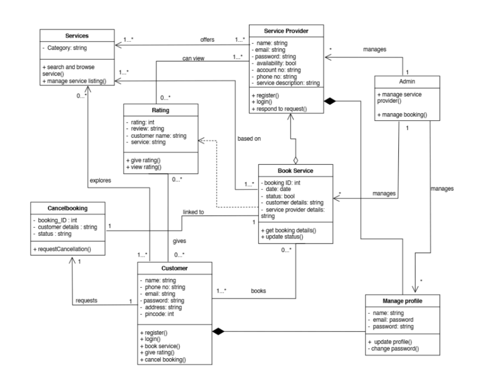

# 📄 Project Report – Fixly  

## 1. Introduction  
Fixly is a web-based service platform designed to connect customers with skilled service providers for a variety of household and commercial needs. The platform simplifies the process of discovering, booking, and managing services while enabling service providers to promote their offerings, track performance, and engage with clients effectively. With its customer-centric approach, Fixly aims to redefine convenience, accessibility, and trust in the home service industry.  

## 2. Problem Statement  
Finding reliable and skilled service providers for everyday tasks remains a persistent challenge for many individuals and businesses. Customers often face issues such as lack of trust in service quality, limited communication with providers, inflexible scheduling options, and no proper reward for their loyalty. Existing platforms like Urban Company and Housejoy offer service booking features but fail to provide personalized experiences and long-term engagement. Furthermore, competitors like Sateen overlook customer loyalty completely, creating a gap in customer retention and satisfaction.  

Service providers also struggle with managing their services efficiently. Most existing solutions lack tools for tracking performance, analyzing customer feedback, and gaining business insights. As a result, professionals miss out on growth opportunities and the chance to build stronger, lasting client relationships.  

## 3. Proposed Solution  
Fixly addresses these challenges by providing an intuitive, feature-rich, and community-driven platform that benefits both customers and service providers. For customers, Fixly offers simple service discovery, flexible appointment scheduling, secure online payments, transparent reviews, and a unique loyalty rewards system to encourage repeat usage. Service providers gain access to service management tools, business insights, real-time communication features, and performance dashboards to grow their businesses effectively.  

By combining convenience, trust, and innovation, Fixly creates a service ecosystem that not only ensures customer satisfaction but also promotes sustainable business opportunities for providers.  

## 4. Aims and Objectives  

### Aims  
- Deliver an efficient and reliable platform for booking everyday services.  
- Empower service providers to manage and promote their offerings.  
- Simplify the process for customers to book, track, and review services.  
- Foster effective communication between service providers and clients.  
- Ensure secure and seamless payment transactions.  

### Objectives  
- Improve service quality through customer feedback and performance analytics.  
- Stand out from competitors by offering a unique loyalty and rewards program.  
- Enhance customer retention with personalized reward systems.  
- Provide growth opportunities for service providers with advanced insights.  
- Build a community-driven platform that encourages continuous engagement.  

## 5. Features  
1. **User Management** – Registration, authentication, and profile management.  
2. **Service Management** – Service creation, editing, and availability updates.  
3. **Booking & Payment** – Appointment scheduling and secure online transactions.  
4. **Resource Sharing** – Upload and access service-related documents and guides.  
5. **Communication Tools** – Real-time chat, notifications, and reminders.  
6. **Analytics & Reporting** – Dashboards for performance tracking and insights.  
7. **Support Services** – Dedicated helpdesk, FAQs, and responsive customer care.  
8. **Review & Rating System** – Transparent feedback mechanism for quality assurance.  
9. **Appointment Scheduling** – Flexible scheduling options for customers and providers.  
10. **Loyalty & Rewards** – Earn points on bookings, referrals, and reviews; redeem for discounts and offers.  

## 6. Tools & Technologies  
- **Frontend:** ReactJS, HTML, CSS, JavaScript  
- **Backend:** Node.js, Express.js  
- **Database:** MongoDB  
- **Authentication:** JWT-based authentication  
- **Payment Gateway:** Razorpay  
- **Hosting & Deployment:** Heroku, Vercel, Netlify  
- **Version Control & Collaboration:** Git, GitHub  

## 7. Related Work  
Several platforms like Urban Company and Housejoy dominate the service industry, offering streamlined service booking experiences. However, these solutions often lack personalization, customer loyalty programs, and advanced provider management tools. Sateen, in particular, overlooks customer retention strategies, limiting long-term engagement. Fixly distinguishes itself by introducing flexible scheduling, advanced communication, performance analytics, and a comprehensive rewards system, ensuring it meets the evolving needs of both customers and service providers.  

## 8. Unique Selling Points (USP)  
- **Exclusive Rewards & Loyalty Program** – A first in this space, offering points and benefits for repeat customers.  
- **Advanced Communication Features** – Real-time messaging and notifications.  
- **Flexible Appointment Scheduling** – Easy rescheduling and availability tracking.  
- **Business Insights for Providers** – Performance dashboards and analytics.  
- **Community-Driven Ecosystem** – Building trust and engagement beyond transactions.  

## 9. Class Diagram (UML)  

